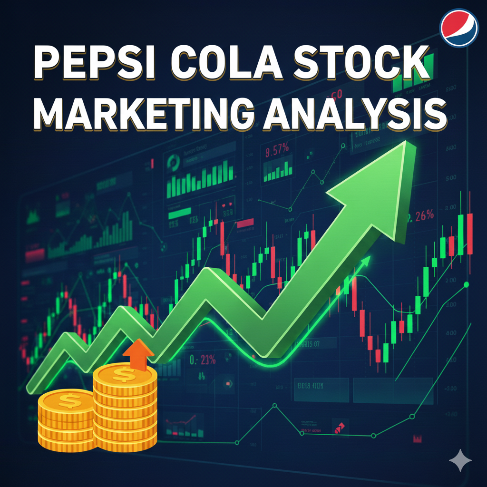

  

 

# PepsiCo (PEP) Stock Analysis Project Documentation

## a. Project Requirements Document (PRD)

**Project Title:** PepsiCo (PEP) Historical Stock Price Analysis & Forecasting
**Objective:** To provide a comprehensive dataset and analysis of PepsiCo Inc. (PEP) stock performance from 2000 to early 2026. This project aims to enable financial researchers, data scientists, and investors to perform exploratory data analysis (EDA), trend identification, and predictive modeling for one of the world's leading food and beverage companies.

**Scope:**

- Historical daily stock price data (Open, High, Low, Close, Volume).
- Statistical summary of market performance over 26 years.
- Identification of long-term growth patterns and volatility cycles.

---

## b. Kaggle Dataset Information

### Column Details

| Column     | Detail           | Type    | Description                                                                 |
| :--------- | :--------------- | :------ | :-------------------------------------------------------------------------- |
| **Date**   | Observation Date | Date    | The trading day (MM/DD/YYYY).                                               |
| **Open**   | Opening Price    | Float   | The price at which the stock first traded upon the opening of the exchange. |
| **High**   | Daily High       | Float   | The highest price reached during the trading day.                           |
| **Low**    | Daily Low        | Float   | The lowest price reached during the trading day.                            |
| **Close**  | Closing Price    | Float   | The final price at which the stock traded during regular market hours.      |
| **Volume** | Trading Volume   | Integer | The total number of shares traded during the day.                           |

---

## c. Top 5 Kaggle Tags

1. `Finance`
2. `Stock Market`
3. `Data Visualization`
4. `Time Series Analysis`
5. `Exploratory Data Analysis`

---

## d. SEO-Optimized Project Name & Description

**Project Name:** PepsiCo Stock Prices (2000-2026) | Historical Financial Data
**Description:** Explore 26 years of PepsiCo Inc. (PEP) historical stock market data. This dataset features daily Open, High, Low, Close, and Volume metrics, perfect for time series forecasting, financial modeling, and investment strategy analysis. Ideal for Kaggle enthusiasts and finance professionals.

---

## e. Dataset Coverage

The dataset provides 100% coverage of all regular trading days for PepsiCo (PEP) on the NASDAQ exchange from January 3, 2000, to January 30, 2026. There are no missing values in the core price or volume columns.

---

## f. Temporal and Geospatial Scope

- **Start Date:** 01/03/2000
- **End Date:** 01/30/2026
- **Geospatial Scope:** United States (NASDAQ Exchange)
- **City/Country:** New York City, USA

---

## g. Provenance

**Source:** Historical financial records aggregated from Yahoo Finance and NASDAQ market archives.
**Transformations:**

- Data was scraped/exported as a CSV.
- Date formats were standardized to MM/DD/YYYY.
- Precision of float values (Open, High, Low, Close) was preserved to ensure accurate technical analysis.
- Volume data was converted to integers for storage efficiency.

---

## h. Dataset Collection Methodology

The data was collected using automated scripts targeting public financial APIs and market data providers. Each entry represents a single trading session. Post-collection, a validation step was performed to ensure that `Low <= Open/Close <= High` for every record, maintaining data integrity for financial modeling.

---

## i. Biggest Problems and Challenges

1. **Market Volatility:** Sudden price swings during global events (e.g., 2008 Crisis, 2020 Pandemic) can skew mean-based models.
2. **Missing Corporate Actions:** While price is accurate, external events like stock splits or dividend payments are factored into "Adjusted Close" (not explicitly separate in this raw view).
3. **Data Volume:** Processing 6,500+ records requires efficient time-indexing for real-time visualization.
4. **Predictive Complexity:** Stock prices are influenced by non-linear factors (geopolitics, earnings reports) not captured in OHLC data alone.

---

## j. Correct Source Link

**Source:** [Yahoo Finance - PepsiCo, Inc. (PEP)](https://finance.yahoo.com/quote/PEP/history)
